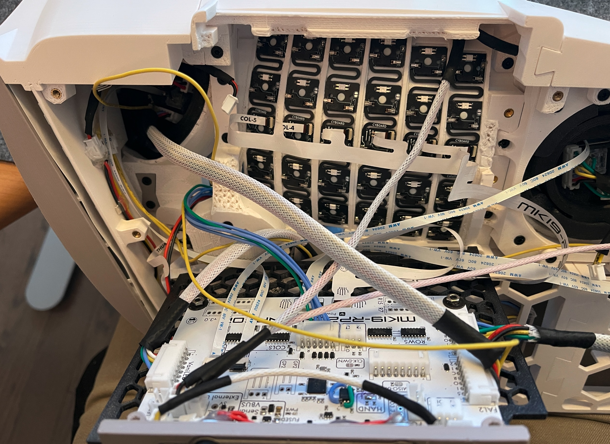
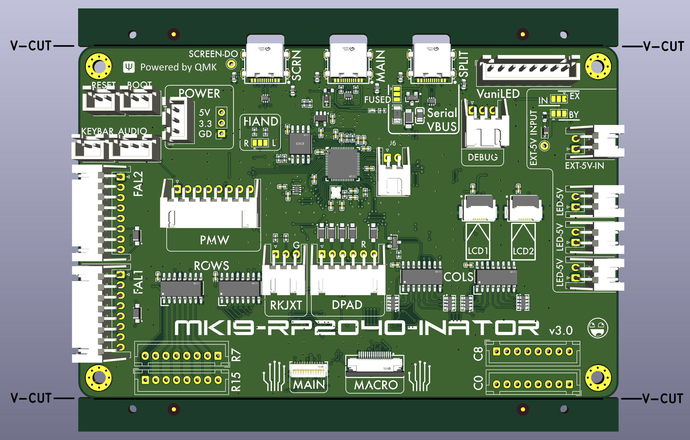
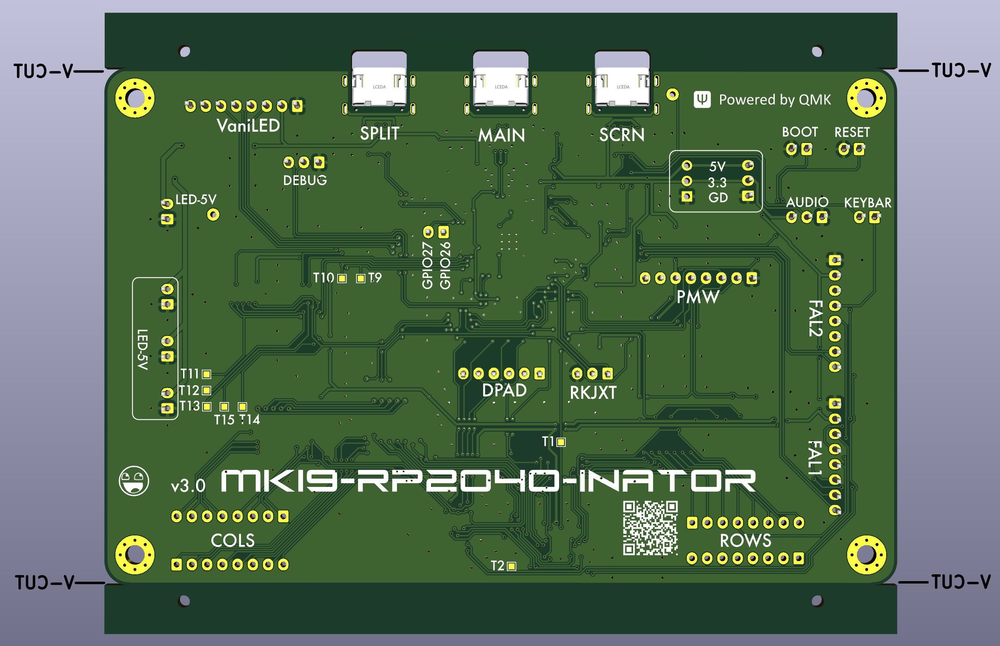
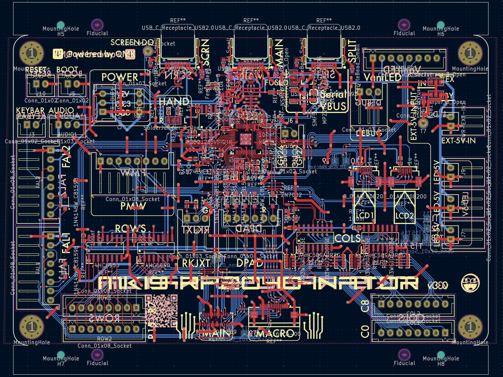
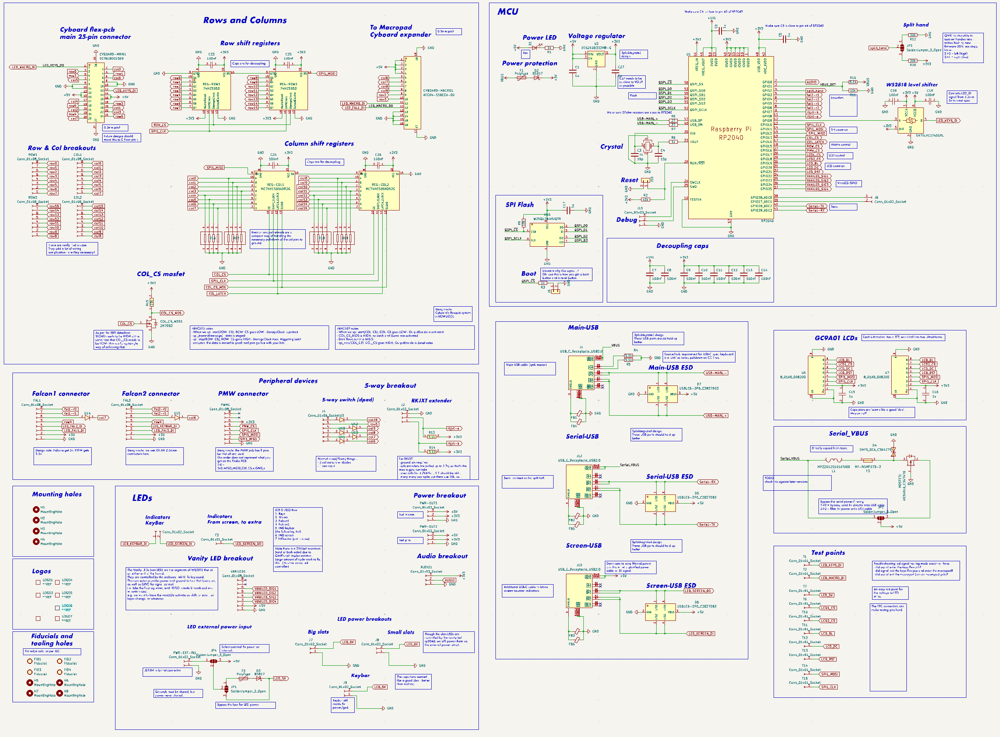

# mk19-rp2040
Attempting to reduce soldering to a minimum - only need to solder the JST-XH headers.  This is the mainboard for the [ArcBoard-mk19](https://github.com/christrotter/qmk_firmware/tree/arcboard-series/keyboards/handwired/arcboard_mk19).

# Features
- On-board RP2040 w. 16MB flash (_based on splinktegrated and reference design_)
- USB-C connectivity for main, split, and screen indicators
- Boot and reset button headers
- Serial vbus power protection (_ESD, polyfuse, diode, etc_)
- External 5v input for LED power (_polyfuse, diode_)
- SPI shift registers to handle rows and cols - up to 256 keys per half - with row/col pin breakouts
- SPI LCD outputs via 0.5mm FPC connectors
- 0.3mm FPC connector for [Cyboard](https://www.cyboard.digital/product-page/dactyl-flex-pcbs) connectivity (or via [this](https://github.com/christrotter/mk19-flex-pcb))
- 0.5mm [macropad](https://github.com/christrotter/macropad-pcb) connector
- Dpad input with diodes (_[RKJXT w. encoder](https://github.com/christrotter/rkjxt-mini-breakout), [5-way](https://github.com/christrotter/5way-pcb), or [4-switch dpad](https://github.com/christrotter/microswitch-dpad)_)
- PMW33XX connector
- 2x [Ultrafalcon](https://github.com/christrotter/ultrafalcon) connectors
- VaniLED connector (_GND,5V,4 gpio; for controlling a secondary RP2040 that handles extra LEDs_)
- Audio, debug, spare pin, power breakouts
- Split-handedness pin solder jumper
- Optional SPI clock pull-down and SPI MISO pull-up resistors
- Test points

# Functional notes
- The LED DI/DO chain flows from main keys (_Cyboard_) to the macropad, then to the dpad (_bodged in post-production_), then UF1, UF2, keybar, screen indicators.
- ROW2COL
- Power LED only indicates you have 5v to the board
- Requires QMK's 'matrix lite' custom matrix feature
  - For more info regarding the custom matrix and shift register implementation, see here: https://github.com/christrotter/shift-register-spi-breakout-pcb
- With everything running it sits at around 1500 scan rate
- First flashing requires holding boot while plugging in main USB; subsequent flashes can use double-press reset button or `QK_BOOT`

# Production notes
- Due to putting the v-cuts on the edge cuts layer, all pcb renders are broken.  This is a known bug in JLC's process.  The pre-production verifications render correctly.
- Requires standard assembly which is a big price increase.
- Make sure to have 'production file verification' checked for PCB and PCBA.

## Post-production fixes
- USB lines were backwards
- Two pins (2 & 5) on the flash were reversed
- The v-cuts were on the wrong layer (should be on the edge cuts layer for JLC)

# PCB overview

